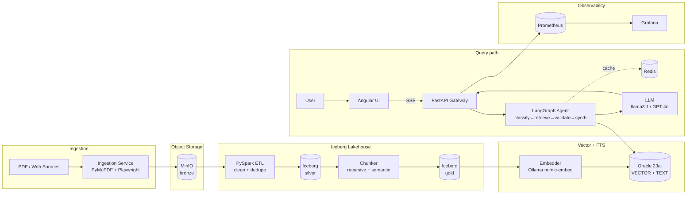

# Architecture

## High-level flow

## Medallion zones

| Zone | Format | Content | Purpose |
|---|---|---|---|
| Bronze | Raw JSON + blobs in MinIO | Untouched scrape output | Replay / audit |
| Silver | Iceberg | Cleaned, deduped, normalized text + metadata | Queryable canonical source |
| Gold | Iceberg | Chunked, enriched with embeddings metadata | Source of truth for indexer |

## Retrieval flow

1. **Classifier** decides query type (factoid / multi-hop / out-of-scope).
2. **Retriever** runs dense ANN + sparse FTS in parallel against Oracle.
3. **RRF** fuses ranked lists (`k=60`).
4. **Validator** checks if top-k context can answer the query (LLM-as-judge, 0–1 score).
5. **Synthesizer** generates answer with `[doc_id:chunk_id]` citations. Refuses if validator < 0.5.
